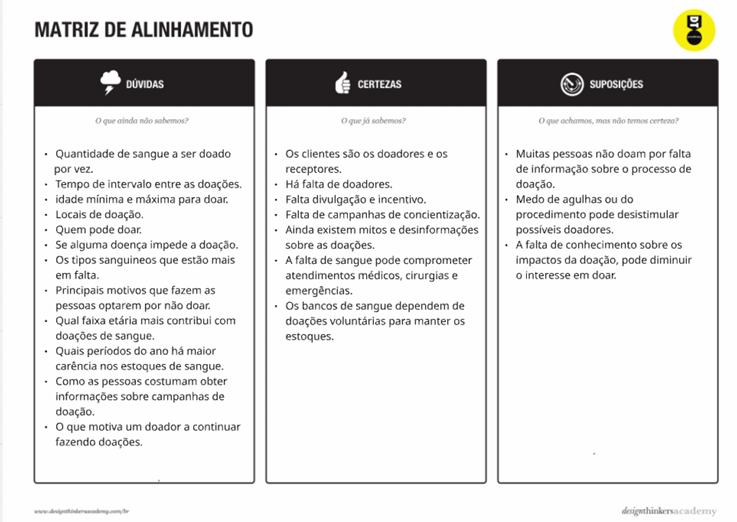
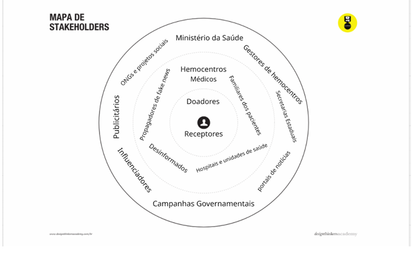
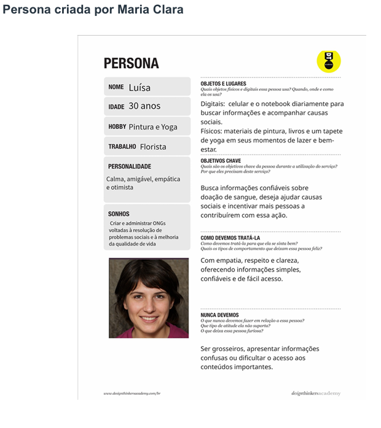
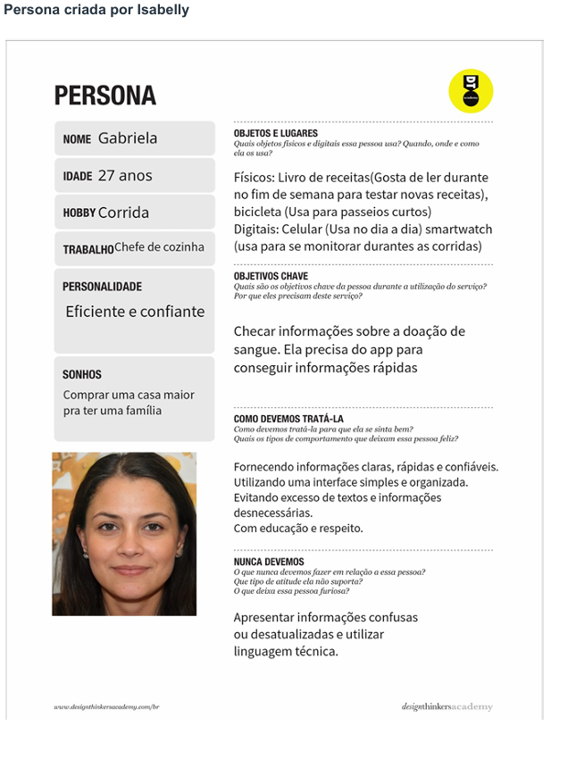
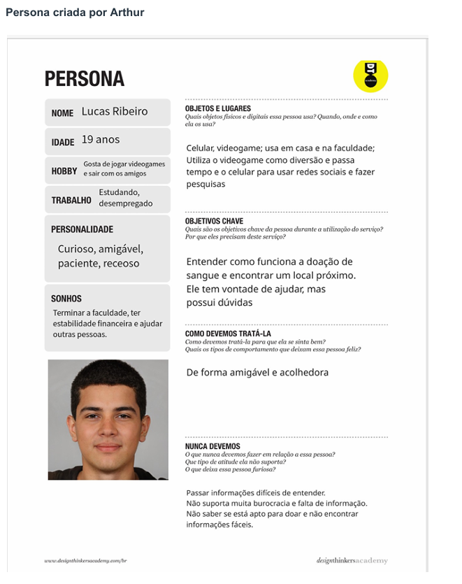
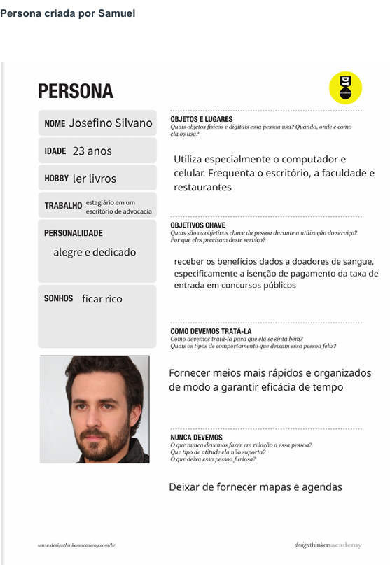
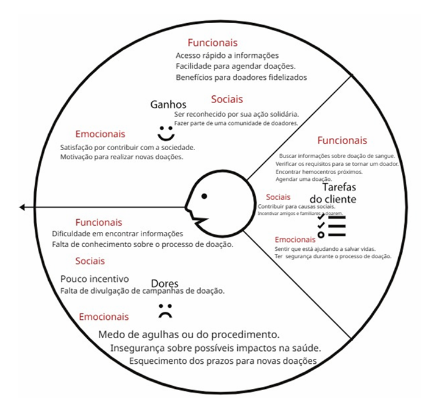
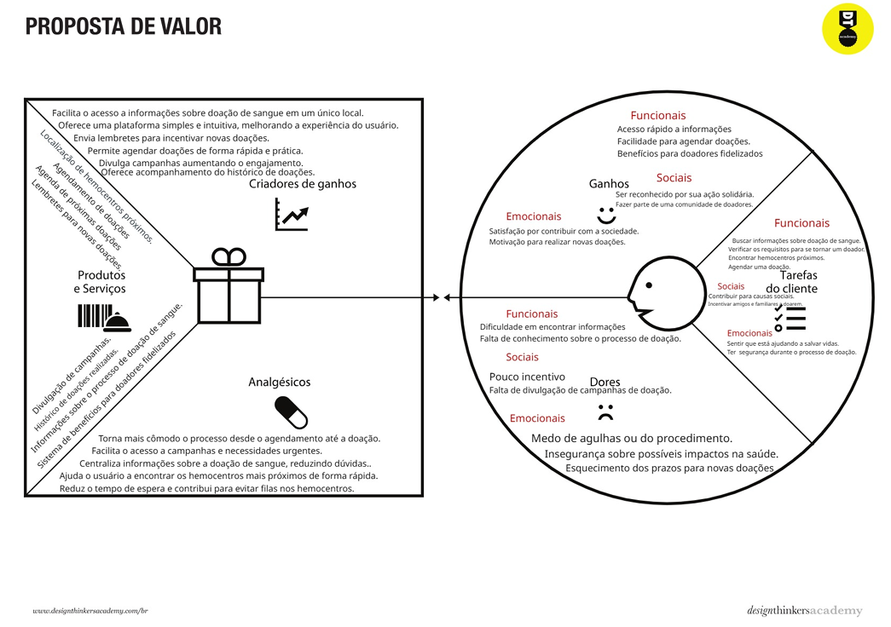
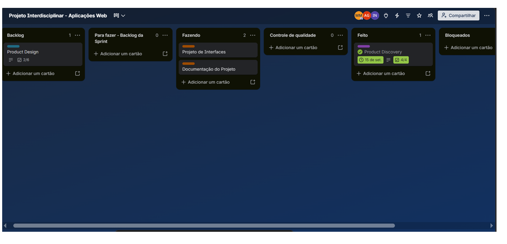

# Trabalho-Interdisciplinar---Doe-Vida
Aplicação web para incentivo à doação de sangue, facilitando o acesso à informação, localização de hemocentros e agendamento de doações.
# Introdução

Informações básicas do projeto.

* **Projeto:** Trabalho Interdisciplinar - Doe-Vida
* **Descrição:** Aplicação web para incentivo à doação de sangue, facilitando o acesso à informação, localização de hemocentros e agendamento de doações.
* **Repositório GitHub:** [LINK PARA O REPOSITÓRIO NO GITHUB]
* **Membros da equipe:**
    * Arthur Barbosa
    * Isabelly Victoria
    * Maria Clara Gomes
    * Samuel Henrique
* **Curso:** Sistemas de Informação / Análise e Desenvolvimento de Sistemas
* **Turno:** Manhã

A documentação do projeto é estruturada da seguinte forma:

1. Introdução
2. Contexto
3. Product Discovery
4. Product Design
5. Metodologia
6. Solução
7. Referências Bibliográficas

 # 1. Introdução

Este projeto tem como objetivo aplicar na prática os conhecimentos adquiridos ao 
longo da disciplina de Aplicações Web, por meio do desenvolvimento de uma 
solução digital para um problema real. Durante sua execução, serão utilizadas 
etapas como levantamento de requisitos, definição de personas, prototipação, 
modelagem de dados, desenvolvimento da interface e implementação das 
funcionalidades do sistema. 
Além da construção da aplicação, o projeto busca desenvolver habilidades técnicas 
e interpessoais, como trabalho em equipe, organização, comunicação, planejamento 
e resolução de problemas. Ao final, espera-se entregar uma solução funcional que 
atenda aos requisitos definidos e demonstre a aplicação dos conceitos estudados 
ao longo do curso.

 #  2. Contexto
A doação de sangue é fundamental para salvar vidas, mas muitos hemocentros 
enfrentam dificuldades para manter seus estoques. Diante disso, este projeto 
propõe o desenvolvimento de uma aplicação web que facilite o acesso à informação 
e incentive a participação de novos doadores. A escolha do tema se justifica por sua 
relevância social e pela oportunidade de aplicar conhecimentos de análise, design e 
desenvolvimento de sistemas web na solução de um problema real. A plataforma 
será voltada principalmente para pessoas interessadas em doar sangue e para 
instituições de coleta, buscando oferecer uma experiência simples, intuitiva e 
acessível.Com isso, busca-se aproximar a população das instituições de saúde e 
contribuir para o aumento das doações de sangue.

# 3. Product discovery

Nesta etapa do projeto, buscamos entender melhor o problema que queremos 
resolver e as necessidades das pessoas que irão utilizar o aplicativo. O **Product** 
**Discovery** tem como objetivo identificar oportunidades, compreender as 
dificuldades dos usuários e alinhar as ideias da equipe para que a solução proposta 
realmente gere impacto. 
Para isso, são realizadas atividades como pesquisas, entrevistas e análises que 
ajudam a conhecer melhor o público-alvo. Com as informações coletadas, é 
possível definir os principais problemas a serem resolvidos e planejar 
funcionalidades que atendam às necessidades dos usuários, criando uma base 
sólida para o desenvolvimento do projeto. 

### Matriz CSD e Mapa de Stakeholders

 ### Matriz CSD (Matriz de Alinhamento) 
Matriz CSD (Certezas, Suposições e Dúvidas) é uma ferramenta utilizada no 
Design Thinking para organizar ideias e alinhar o conhecimento da equipe sobre o 
projeto. Ela ajuda a identificar o que já sabemos, o que acreditamos ser verdade e o 
que ainda precisa ser investigado.

Através de pesquisas, fizemos novas descobertas que ampliaram nossas ideias, 
como: O sistema de pontos adotados pelos Hemocentros e plataformas de 
incentivo, onde a frequência que você doa gera um vínculo de fidelização que gera 
direitos a benefícios. Também nos atualizamos sobre a idade máxima para realizar 
doações, que será atualizada em outubro de 2026 através de novas regras que 
entraram em vigor. Além de outras dúvidas que foram esclarecidas, possibilitando a 
organização de novas ideias.

### Mapa de Stakeholders   
Stakeholders são todas as pessoas, grupos ou instituições que podem ser 
impactados ou ter interesse em um projeto. O Mapa de Stakeholders ajuda a 
identificar esses envolvidos e compreender sua relação e influência dentro do 
contexto analisado.

Para a montagem do Mapa de Stakeholders analisamos os principais envolvidos, 
sendo eles:
* Pessoas fundamentais 
* Pessoas importantes  
* Pessoas Influenciadoras

Identificamos os envolvidos, com base em suas contribuições positivas ou negativas 
e como poderiam influenciar no projeto. Percebemos que Influenciadores que 
propagam fake news e desinformação sobre a doação de sangue, alcançam grande 
parte do público desestimulando-os. Com isso, será necessário a conscientização 
desses indivíduos.  

### Personas e Proposta de Valor (Perfil do Cliente)  

A criação de personas permite compreender melhor o público-alvo do projeto, 
representando seus perfis, necessidades e comportamentos. Com personas bem 
definidas, a equipe consegue visualizar com mais clareza quem são os usuários, 
quais são suas dificuldades e o que esperam de uma solução. Esse entendimento 
auxilia na tomada de decisões durante o desenvolvimento, garantindo que o projeto 
esteja mais alinhado às necessidades reais das pessoas envolvidas.

### Perfil do cliente

A análise do perfil do cliente é realizada para entender melhor quem irá utilizar a 
aplicação. É identificadas as principais tarefas que os usuários desejam realizar, os 
benefícios que esperam obter e as dificuldades que enfrentam. Essas informações 
ajudam a desenvolver uma solução mais útil, simples e alinhada às necessidades 
do público-alvo.

# 4. Product design

A etapa de Product Design tem como objetivo transformar as ideias e 
necessidades identificadas durante a análise do projeto em uma solução visual e 
funcional. Nessa fase, são desenvolvidos wireframes, protótipos e definições de 
interface que permitem visualizar como o sistema será utilizado pelos usuários. 
O foco é criar uma experiência simples, intuitiva e alinhada às necessidades do 
público-alvo, garantindo que as funcionalidades atendam aos objetivos do projeto. 
Ao final dessa etapa, espera-se obter um protótipo validado e um conjunto de 
especificações que servirão como base para o desenvolvimento da aplicação. 

### Histórias de Usuários e Proposta de Valor

 #### História de Usuário 

As histórias de usuário foram feitas para representar as principais necessidades dos 
usuários no aplicativo. Elas descrevem funcionalidades a partir da necessidade  de 
quem utilizará o sistema, de forma que seja possível compreender quais atividades 
serão realizadas e quais benefícios serão oferecidos. Dessa forma, as histórias 
auxiliam na definição do “corpo” do projeto e na organização das funcionalidades às 
necessidades do público-alvo. 

História 1 (Arthur) 
**Eu como:** responsável por um hemocentro 
**Quero:** divulgar informações sobre doação e os locais de atendimento 
**Para:** aumentar o número de pessoas que realizam doações.

História 2 (Arthur) 
**Eu como:** representante do Ministério da Saúde 
**Quero:** divulgar campanhas de conscientização sobre a doação de sangue 
**Para:** incentivar a população a se tornar doadora.

História 3 (Isabelly) 
**Eu como:** Influenciador 
**Quero:** Me inscrever para doar sangue  
**Porque/ para:** Para conseguir o benefício de pagar mais barato em shows e ter acesso a 
fila prioritária 

História 4 (Isabelly) 
**Eu como:** Ongs e projetos sociais  
**Quero:** Receber notícias sobre campanhas de doação e lembretes de quando os membros 
do projeto estiverem prontos para doar novamente  
**Porque/para:** Para divulgar as campanhas e manter uma frequência de doações, ajudando 
mais pessoas 

História 5 (Maria Clara) 
**Eu como:** potencial doador 
**Quero:** acessar informações sobre os requisitos para doação de sangue 
**Para:** verificar se estou apto a realizar uma doação. 

História 6 (Maria Clara) 
**Eu como:** doador 
**Quero:** localizar hemocentros próximos 
**Para:** encontrar um local adequado para realizar minha doação. 

História 7  (Samuel) 
**Eu como:** parente de uma pessoa que foi salva por sangue doado 
**Quero:** participar do processo de doação  
**Para:** ajudar pessoas que necessitam de sangue 

História 8  (Samuel) 
**Eu como:** repórter/jornalista 
**Quero:** acessar um app confiável a respeito de doação de sangue 
**Para:** coletar informações que possam ser usadas em uma matéria ou campanha 
publicitária

 # 5. Metodologias

 #### Ferramentas

Para o desenvolvimento do projeto foram utilizadas diferentes ferramentas de apoio 
ao planejamento, documentação e prototipação. O**Google Docs** foi utilizado para a 
elaboração da documentação do projeto, permitindo a edição simultânea pelos 
integrantes da equipe. O **Miro** foi utilizado na construção do Product Discovery, 
como Matriz CSD , Mapa de stakeholders, Personas e Proposta de valor . O **Figma** 
foi utilizado para a criação dos wireframes, protótipos interativos e Fluxos dos 
usuários da aplicação, possibilitando a visualização da experiência do usuário. Já o 
**Trello** foi usado para o gerenciamento das tarefas e acompanhamento do progresso 
do projeto por meio da metodologia Kanban. 

- Organização da equipe e divisões de papéis 
A equipe adotou práticas inspiradas no framework Scrum para organizar o 
desenvolvimento do projeto. O papel de Scrum Master foi destinado á Maria Clara, 
responsável por auxiliar na organização das atividades e acompanhar o andamento 
das entregas. As tarefas foram divididas entre os integrantes de acordo com as 
etapas do projeto, de forma que cada membro contribuiu com uma parte do 
trabalho. Ao final de cada etapa, as contribuições foram reunidas e consolidadas em 
uma única entrega.

 - Quadro e controle de tarefas 
O gerenciamento das atividades foi realizado por meio de um quadro Kanban 
desenvolvido no Trello. As tarefas foram inicialmente organizadas em cartões 
correspondentes às etapas de Product Discovery e Product Design, contendo 
checklists com as atividades necessárias para sua conclusão. Conforme 
iniciavamos uma tarefa, era criado um cartão específico para aquela tarefa, que era 
movido para a coluna Fazendo. O checklist correspondente permanecia no cartão 
principal da etapa, permitindo acompanhar o progresso geral.
 Após a conclusão da atividade, o cartão era movido para Feito e o checklist da etapa era atualizado. 
Quando todas as atividades de uma etapa eram concluídas, o cartão principal 
também era movido para a coluna Feito, garantindo uma visão clara das tarefas 
pendentes, em andamento e concluídas ao longo do projeto.

